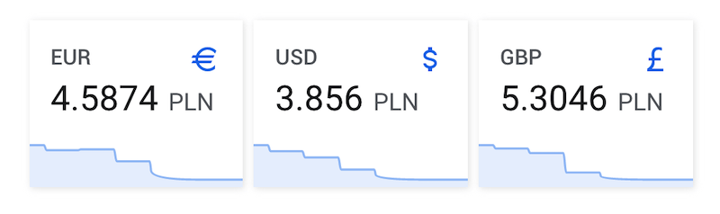
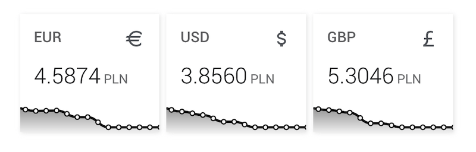

[](#)
[](#)
[](https://github.com/korasinski/ha-nbp/releases)
[](https://github.com/custom-components/hacs)
[](https://www.buymeacoffee.com/korasinski)


# Custom component for NBP - Narodowy Bank Polski
A sensor which allows you to collect currency rates from Narodowy Bank Polski using HTTP API and `sensor` entity.

### Supported currencies
Support for all currencies from [**NBP table C**](https://www.nbp.pl/home.aspx?f=/kursy/kursyc.html): 
Currency code | Currency name  
:--- | :---  
**AUD** | Australian Dollar
**CAD** | Canadian Dollar
**CHF** | Swiss Franc
**CZK** | Czech Koruna
**DKK** | Danish Krone
**EUR** | Euro
**GBP** | British Pound Sterling
**HUF** | Hungarian Forint
**JPY** | Japanese Yen
**NOK** | Norwegian Krone
**SEK** | Swedish Krona
**USD** | United States Dollar
**XDR** | SDR (MFW)

### Features
 - [X] Bid price
 - [X] Ask price
 - [X] Currency code
 - [X] Currency name (in Polish)
 - [X] Table number
 - [X] Table effective date
 - [X] Table trading date
 - [ ] UI configuration setup


## Screenshots

_Component can be used with default [sensor card](https://www.home-assistant.io/lovelace/sensor/):_



_and [Mini Graph Card](https://github.com/kalkih/mini-graph-card) from [kalkih](https://github.com/kalkih/):_



## Instalation
### Manual installation

- Put the files from `/custom_components/nbp/` in your HA config folder under `<config directory>/custom_components/nbp/`
- Restart Home Assistant
- Configure new integration in `configuration.yaml`, see details below
- Restart Home Assistant again
- Add `nbp_*` entity (or entities) to the UI
- Reload UI and use new integration :) 

### Installation via HACS
- Copy repository URL: `https://github.com/korasinski/ha-nbp` to Custom repositories in HACS
- Click Add button and browse the repository list to install newest relase
- Integration will be loaded after restart of Home Assistant
- Configure new integration in `configuration.yaml`, see details below
- Restart Home Assistant again and configure `nbp_*` entity (or entities) on your UI

## Configuration
**Minimum configuration.yaml:**

```yaml
- platform: nbp
  currency:
    - code: USD
    - code: EUR
```
**Full configuration.yaml:**

```yaml
- platform: nbp
  scan_interval: 00:60:00
  currency:
    - code: USD
      name: USD to PLN
    - code: EUR
      name: EUR to PLN
```
**Configuration variables:**  

key | description  
:--- | :---  
**platform** _(Required)_ | The platform name `nbp`
**scan_interval** _(Optional)_ | A time peroid _(hh:mm:ss)_ how often the integration shold pull new data from NBP, default is `60 minutes` 
**currency** _(Required)_ | List of currencies for which `sensor` entities will be created
**code** _(Required)_ | Currency code (see [supported currencies](#supported-currencies)) in **UPPERCASE**
**name** _(Optional)_ | Name of the entity, default will be picked from `code`


> <sup>All trademarks and registered trademarks presented in the pictures above are property of their respective owners.</sup><br>